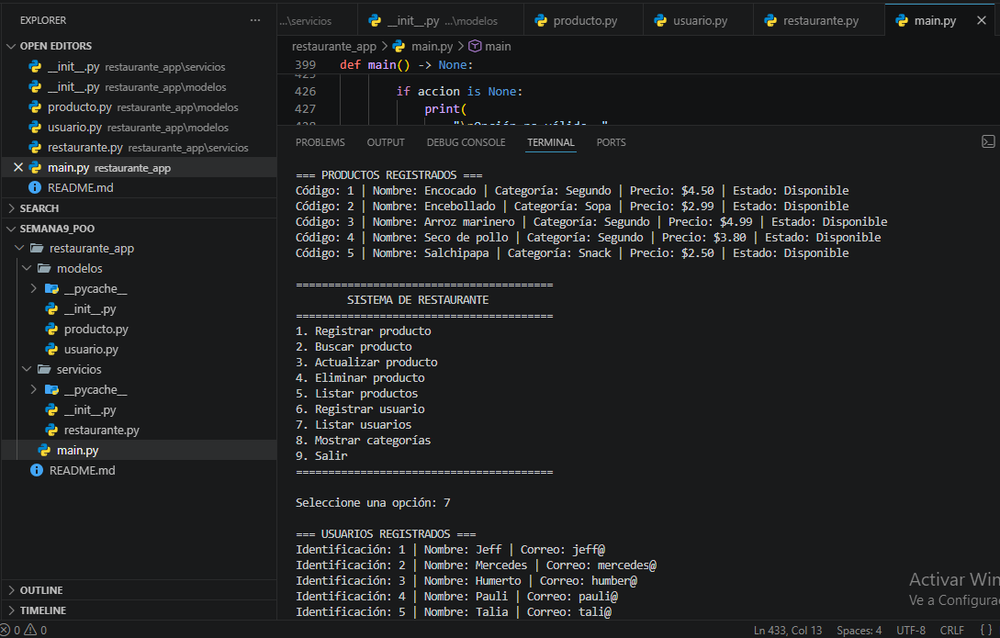

# Restaurante App

**Estudiante:** Males Conejo Janneth Talía

## Semana 9 - Programación Orientada a Objetos

## Descripción

Restaurante App es una aplicación desarrollada en Python utilizando Programación Orientada a Objetos (POO).

El proyecto representa la administración básica de un restaurante mediante una aplicación de consola. En esta versión se incorporan estructuras de datos fundamentales de Python para administrar colecciones de objetos y datos del sistema.

El sistema permite administrar:

- Productos.
- Usuarios.
- Categorías de productos.

Las operaciones principales sobre productos son:

- Registrar.
- Buscar.
- Actualizar.
- Eliminar.
- Listar.

También permite:

- Registrar usuarios.
- Listar usuarios.
- Mostrar las categorías únicas de los productos.

La aplicación mantiene una arquitectura modular separando los modelos, el servicio encargado de administrar las colecciones y el punto de entrada del programa.

---

# Estructura del proyecto

```text
restaurante_app/
├── modelos/
│   ├── __init__.py
│   ├── producto.py
│   └── usuario.py
├── servicios/
│   ├── __init__.py
│   └── restaurante.py
├── main.py
└── README.md


